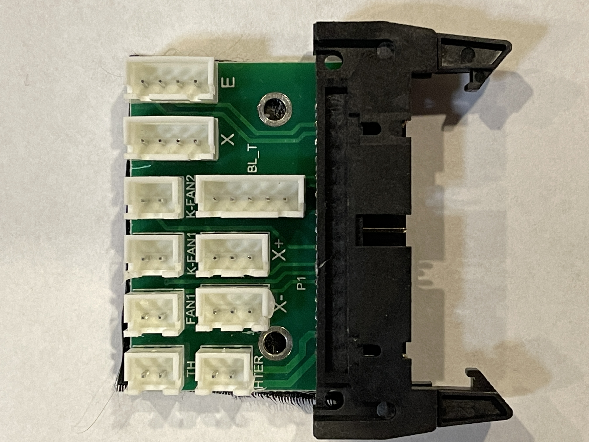

# SV04

## Photos for Pins
- #### Pins 
  - ###### Probably All of the Pins Used by the MCU

- #### Creality v5.2.1 Board

- #### Breakout Board

## Links
#### MCU
- https://www.gigadevice.com/microcontroller/gd32f303vet6/
- https://gd32mcu.com/en/download/0?kw=GD32F3
- https://gd32mcu.com/data/documents/datasheet/GD32F303xx_Datasheet_Rev2.0.pdf
- https://www.gd32mcu.com/data/documents/userManual/GD32F30x_User_Manual_Rev2.9.pdf
#### TMC2209
- https://www.trinamic.com/products/integrated-circuits/details/tmc2209-la
